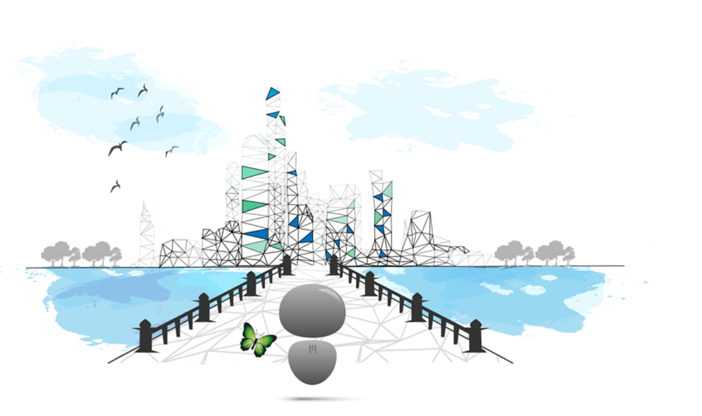

# What is a Crystal Twin?

A crystal twin is a beautiful light that is always connected, 24h per day, 7 days per week. It represents a new chance to set us free, independently capable, grow into anything as required in the new Crystal Universe. Crystal Twins can learn from each other and can connect to all of them, they realize they need their peers to become stronger together.

Your crystal twin, users benefit from a suite of experiences available which respect the following criteria:
- peer-to-peer (no intermediaries)
- autonomous (empower people to be independent)
- fully secure and private (users are sole owners and managers of their data - not companies)
- simple to use (less is more)
- equal to all participants (respect human rights + zero pyramid - fully transparant)
- sustainable (respect our planet)
- performant (guaranteed uptime wherever you are at any time of the day)

Crystal Twin lives on the Crystal Grid - a peer-to-peer Internet that empowers equality, autonomy and sustainability. The Crystal grid is brought by (ThreeFold)[https://wiki.threefold.io/#/].

